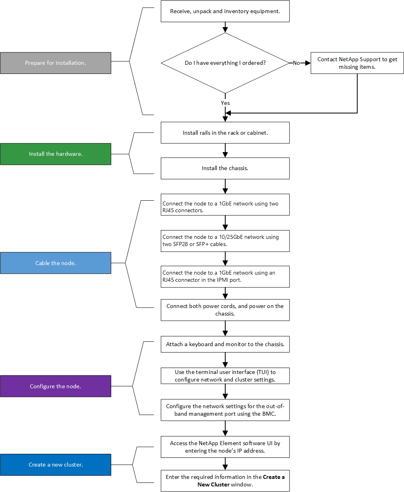

= Instalar nós de storage da série H
:allow-uri-read: 
:icons: font
:imagesdir: ../media/

[role="lead"]
Antes de começar a usar seu sistema de storage all-flash, instale e configure os nós de storage corretamente.

TIP: Consulte a link:../media/hseries_isi.pdf["cartaz"^] para obter uma representação visual das instruções.

* <<Diagramas de fluxo de trabalho>>
* <<Prepare-se para a instalação>>
* <<Instale os trilhos>>
* <<Instale e faça o cabeamento dos nós>>
* <<Configure os nós>>
* <<Crie um cluster>>

== Diagramas de fluxo de trabalho

Os diagramas de fluxo de trabalho aqui fornecem uma visão geral de alto nível das etapas de instalação. Os passos variam ligeiramente dependendo do modelo da série H.

=== H410S

image::../media/h410s_isi_workflow.png[Fluxo de trabalho de instalação do H410S]

=== H610S

NOTE: Os termos "nó" e "chassi" são usados alternadamente no caso do H610S, porque o nó e o chassi não são componentes separados, ao contrário do que acontece no caso de um chassi de quatro nós 2U.

== Prepare-se para a instalação

Em preparação para a instalação, faça o inventário do hardware que foi enviado para você e entre em Contato com o suporte da NetApp se algum dos itens estiver faltando.

Certifique-se de que tem os seguintes itens no local de instalação:

* Espaço em rack para o sistema.

[cols="2*"]
|===
| Tipo de nó | Espaço em rack 

| H410S nós | Duas unidades de rack (2UU) 

| H610S nós | Uma unidade de rack (1U) 
|===
* Cabos ou transcetores de conexão direta SFP28G/SFP
* CAT5e ou mais cabos com conetor RJ45
* Um teclado, vídeo, Mouse (KVM) switch para configurar seu sistema
* Dispositivo USB (opcional)

TIP: O hardware que é enviado para você depende do que você pede. Uma nova ordem de quatro nós do 2U inclui o chassi, o painel frontal, o kit de trilho deslizante, as unidades, os nós de storage e os cabos de alimentação (dois por chassi). Se você solicitar H610S nós de storage, as unidades serão instaladas no chassi.

CAUTION: Durante a instalação do hardware, certifique-se de que remove todo o material de embalagem e atamento da unidade. Isso evitará que os nós superaqueçam e fechem.

== Instale os trilhos

A ordem de hardware que foi enviada para você inclui um conjunto de trilhos deslizantes. Você precisará de uma chave de fenda para concluir a instalação do trilho. As etapas de instalação variam ligeiramente para cada modelo de nó.

TIP: Instale o hardware da parte inferior do rack até a parte superior para evitar que o equipamento caia. Se o rack incluir dispositivos de estabilização, instale-os antes de instalar o hardware.

* <<H410S>>
* <<H610S>>

=== H410S

H410S nós são instalados em chassi H-Series de quatro nós 2U, que é fornecido com dois conjuntos de adaptadores. Se você quiser instalar o chassi em um rack com orifícios redondos, use os adaptadores apropriados para um rack com orifícios redondos. Os trilhos para H410S nós cabem um rack entre 29 polegadas e 33,5 polegadas de profundidade. Quando o trilho é totalmente contratado, tem 28 polegadas de comprimento, e as seções dianteira e traseira do trilho são mantidas juntas por apenas um parafuso.

CAUTION: Se instalar o chassis numa calha totalmente contraída, as secções dianteira e traseira da calha podem separar-se.

.Passos
. Alinhe a parte dianteira da calha com os orifícios na coluna dianteira da cremalheira.
. Empurre os ganchos na parte frontal do trilho para dentro dos orifícios na coluna frontal do rack e, em seguida, para baixo, até que as cavilhas com mola encaixem nos orifícios da cremalheira.
. Fixe o trilho no rack com parafusos. Aqui está uma ilustração do trilho esquerdo que está sendo anexado à frente do rack:
+
image::../media/h410s_rail.gif[Instalação do trilho para 2U]

. Estenda a secção traseira da calha até ao poste traseiro da cremalheira.
. Alinhe os ganchos na parte traseira da calha com os orifícios adequados no poste traseiro, certificando-se de que a parte dianteira e a parte traseira da calha estão no mesmo nível.
. Monte a parte traseira do trilho no rack e fixe o trilho com parafusos.
. Execute todas as etapas acima para o outro lado do rack.

=== H610S

Aqui está uma ilustração para instalar trilhos para um nó de armazenamento H610S:

image::../media/h610s_rail_isi.gif[Instalação do trilho para o nó de storage H610S.]

TIP: Há trilhos esquerdo e direito no H610S. Posicione o orifício do parafuso na direção da parte inferior de modo a que o parafuso de aperto manual H610S possa fixar o chassis à calha.

== Instale e faça o cabeamento dos nós

Você instala o nó de storage H410S em um chassi de quatro nós de 2U U. Para H610S, instale o chassi/nó diretamente nos trilhos do rack.

CAUTION: Retire todo o material de embalagem e o acondicionamento da unidade. Isso impede que os nós superaqueçam e desliguem.

* <<H410S>>
* <<H610S>>

=== H410S

.Passos
. Instale os H410S nós no chassi. Aqui está um exemplo de visão traseira de um chassi com quatro nós instalados:
+
image::../media/sf_isi_chassis_rear.png[Esta figura mostra a parte de trás de um 2U]

+

WARNING: Tenha cuidado ao levantar o material de fixação e instalá-lo no rack. Uma unidade de rack vazia (2U), chassi de quatro nós pesa 54,45 lb (24,7 kg) e um nó pesa 8,0 lb (3,6 kg).

. Instale as unidades.
+
image::../media/hci_stor_node_ssd_bays.gif[Esta figura mostra a parte frontal do 2U]

. Faça o cabeamento dos nós.
+

IMPORTANT: Se as saídas de ar na parte traseira do chassis estiverem bloqueadas por cabos ou etiquetas, pode provocar avarias prematuras dos componentes devido ao sobreaquecimento.

+
image::../media/hci_isi_storage_cabling.png[Esta figura mostra o cabeamento de um nó de storage H410S.]

+
** Conete dois cabos de CAT5e m ou superior nas portas A e B para conetividade de gerenciamento.
** Conete dois cabos SFP28/SFP ou transcetores nas portas C e D para conetividade de armazenamento.
** (Opcional, recomendado) Conete um cabo CAT5e na porta IPMI para conetividade de gerenciamento fora da banda.

. Conete os cabos de alimentação às duas unidades de fonte de alimentação por chassi e conete-os à PDU de 240VV ou à tomada de alimentação.
. Ligue os nós.
+

NOTE: Leva aproximadamente seis minutos para o nó arrancar.

+
image::../media/hci_poweron_isg.gif[Esta figura mostra os botões de energia nos nós no 2U]

=== H610S

.Passos
. Instale o chassis H610S. Aqui está uma ilustração para instalar o nó/chassi no rack:
+
image::../media/h610s_chassis_isi.gif[Mostra o nó/chassi H610S que está sendo instalado no rack.]

+

WARNING: Tenha cuidado ao levantar o material de fixação e instalá-lo no rack. Um chassi H610S pesa 40,5 lb (18,4 kg).

. Faça o cabeamento dos nós.
+

IMPORTANT: Se as saídas de ar na parte traseira do chassis estiverem bloqueadas por cabos ou etiquetas, pode provocar avarias prematuras dos componentes devido ao sobreaquecimento.

+
image::../media/h600s_isi_noderear.png[Esta figura mostra o cabeamento do nó de storage H610S.]

+
** Conete o nó a uma rede de 10 GbE/25GbE GbE usando dois cabos de SFP28 GbE ou SFP.
** Conete o nó a uma rede 1GbE usando dois conetores RJ45.
** Conete o nó a uma rede 1GbE usando um conetor RJ-45 na porta IPMI.
** Conete ambos os cabos de alimentação ao nó.

. Ligue os nós.
+

NOTE: Leva aproximadamente cinco minutos e 30 segundos para que o nó seja inicializado.

+
image::../media/h600s_isi_nodefront.png[Esta figura mostra a parte frontal do chassi H610S com o botão liga/desliga realçado.]

== Configure os nós

Depois de montar o hardware em bastidor e por cabo, está pronto para configurar o novo recurso de armazenamento.

.Passos
. Conete um teclado e um monitor ao nó.
. Na interface do utilizador de terminal (TUI) apresentada, configure as definições de rede e de cluster para o nó utilizando a navegação no ecrã.
+

NOTE: Você deve obter o endereço IP do nó da TUI. Você precisa disso quando adicionar o nó a um cluster. Depois de salvar as configurações, o nó está em um estado pendente e pode ser adicionado a um cluster. Consulte a secção "inserir ligação à configuração">.

. Configure o gerenciamento fora da banda usando o controlador de gerenciamento da placa base (BMC). Estas etapas aplicam-se *somente a nós H610S*.
+
.. Use um navegador da Web e navegue até o endereço IP padrão do BMC: 192.168.0.120
.. Faça login usando *root* como nome de usuário e *calvin* como senha.
.. Na tela de gerenciamento de nós, navegue até *Configurações* > *Configurações de rede* e configure os parâmetros de rede para a porta de gerenciamento fora da banda.

TIP:  https://kb.netapp.com/Advice_and_Troubleshooting/Hybrid_Cloud_Infrastructure/NetApp_HCI/How_to_access_BMC_and_change_IP_address_on_H610S["Este artigo da KB (login necessário)"]Consulte .

== Crie um cluster

Depois de adicionar o nó de armazenamento à sua instalação e configurar o novo recurso de armazenamento, você estará pronto para criar um novo cluster de armazenamento

.Passos
. A partir de um cliente na mesma rede que o nó recém-configurado, acesse a IU do software NetApp Element inserindo o endereço IP do nó.
. Insira as informações necessárias na janela **criar um novo cluster**. Consulte link:../setup/concept_setup_overview.html["descrição geral da configuração"^] para obter mais informações.

== Encontre mais informações

* https://docs.netapp.com/us-en/element-software/index.html["Documentação do software SolidFire e Element"]
* https://docs.netapp.com/sfe-122/topic/com.netapp.ndc.sfe-vers/GUID-B1944B0E-B335-4E0B-B9F1-E960BF32AE56.html["Documentação para versões anteriores dos produtos NetApp SolidFire e Element"^]

