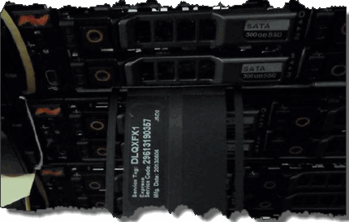

= Substitua um chassi
:allow-uri-read: 
:icons: font
:imagesdir: ../media/

[role="lead"]
Talvez seja necessário substituir o chassi se o ventilador, a unidade de processamento central (CPU) ou o módulo de memória em linha dupla (DIMM) falharem, ou para corrigir problemas de superaquecimento ou problemas com o processo de inicialização. As avarias no painel de instrumentos na interface do utilizador do software NetApp Element (UI) e a luz âmbar intermitente na parte frontal do chassis são indicações de uma possível necessidade de substituição do chassis. Você deve entrar em Contato com o suporte da NetApp antes de prosseguir.

.O que você vai precisar
* Você entrou em Contato com o suporte da NetApp.
+
Se você estiver solicitando uma substituição, você deve ter um caso aberto com o suporte da NetApp.

* Obteve o chassis de substituição.
* Você tem uma pulseira de descarga eletrostática (ESD), ou você tomou outra proteção antiestática.
* Se necessitar de efetuar o processo de retorno à imagem de fábrica (RTFI), obteve a chave USB.
+
O suporte da NetApp irá ajudá-lo a decidir se o RTFI é necessário.  https://kb.netapp.com/Advice_and_Troubleshooting/Hybrid_Cloud_Infrastructure/NetApp_HCI/How_to_create_an_RTFI_key_to_re-image_a_SolidFire_storage_node["Este artigo da KB (login necessário)"]Consulte .

* Você tem um teclado e um monitor.

.Sobre esta tarefa
As instruções neste documento se aplicam se você tiver um chassi de uma unidade de rack (1UU) com qualquer um dos seguintes nós:

* SF2405
* SF4805
* SF9605
* SF9608
* SF19210
* SF38410
* SF-FCN-01
* FC0025

[NOTE]
====
Dependendo da versão do software Element, os seguintes nós não são suportados:

* A partir dos nós de storage Element 12,7, SF2405 e SF9608 e dos nós FC de FC0025 e SF-FCN-01.
* A partir dos nós de storage Element 12,0, SF3010, SF6010 e SF9010.

====
.Passos
. Localize a etiqueta de serviço do chassi com falha e verifique se o número de série corresponde ao número no caso que você abriu com o suporte NetApp quando você solicitou a substituição.
+
Você pode localizar a etiqueta de serviço na parte frontal do chassi.

+
A figura a seguir é um exemplo da etiqueta de serviço:

+

+

NOTE: A figura acima é um exemplo. A localização exata da etiqueta de serviço pode variar dependendo do modelo de hardware.

. Conete o teclado e o monitor à parte traseira do chassi com falha.
. Verifique as informações do chassi com o suporte da NetApp.
. Desligue o chassis.
. Identifique as unidades na parte frontal do chassi e os cabos na parte traseira.
+

NOTE: Os nós Fibre Channel não têm unidades na frente.

. Retire as unidades e os cabos da fonte de alimentação.
. Retire as unidades cuidadosamente e coloque-as numa superfície plana e antiestática.
+

NOTE: Se você tiver um nó Fibre Channel, ignore esta etapa.

. Remova o chassi pressionando a trava ou desapertando o parafuso de aperto manual, com base no modelo do hardware.
+
Você deve empacotar e retornar o chassi com falha ao NetApp.

. *Opcional*: Remova os trilhos e instale os novos trilhos que foram enviados com seu chassi de substituição.
+
Você pode optar por reutilizar os trilhos existentes. Se você estiver reutilizando os trilhos existentes, você pode pular esta etapa.

. Faça deslizar o chassis de substituição para os trilhos.
. Para nós de storage, insira as unidades do chassi com falha no chassi de substituição.
+

NOTE: Você deve inserir as unidades nos mesmos slots que estavam no chassi com falha.

. Instale as unidades da fonte de alimentação.
. Insira os cabos da fonte de alimentação e os cabos 1GbE e 10GbE nas portas originais.
+
Transcetores plugáveis de fator de forma pequeno (SFP) podem ser inseridos nas 10GbE portas do chassi de substituição. Você deve removê-los antes de fazer o cabo das 10GbE portas.

. Se você determinou que não precisa executar o processo RTFI no nó, inicialize o nó e aguarde até que a interface do usuário do terminal (TUI) seja exibida. Avance para o passo 16 e permita que o cluster refaça a imagem do nó automaticamente quando o adicionar utilizando a IU.
. *Opcional*: Se o suporte da NetApp recomendar a nova geração de imagens do nó com uma chave USB, execute as seguintes etapas:
+
.. Ligue o chassis. Ele inicializa com a imagem de chave RTFI.
.. No primeiro prompt, digite *Y* para fazer a imagem do nó de armazenamento.
.. No segundo prompt, digite *N* para verificações de integridade do hardware.
+
Se o script RTFI detetar um problema com um componente de hardware, ele exibirá um erro no console. Se você vir um erro, entre em Contato com o suporte da NetApp. Depois que o processo RTFI for concluído, o nó será desligado.

.. Retire a chave USB da ranhura USB.
.. Inicialize o nó recém-imaginado e aguarde que o TUI apareça.

. Configure as informações de rede e cluster a partir da TUI.
+
Você pode entrar em Contato com o suporte da NetApp para obter assistência.

. Adicione o novo nó ao cluster usando o cluster TUI.
. Embale e devolva o chassis com falha.

== Encontre mais informações

* https://docs.netapp.com/us-en/element-software/index.html["Documentação do software SolidFire e Element"]
* https://docs.netapp.com/sfe-122/topic/com.netapp.ndc.sfe-vers/GUID-B1944B0E-B335-4E0B-B9F1-E960BF32AE56.html["Documentação para versões anteriores dos produtos NetApp SolidFire e Element"^]

