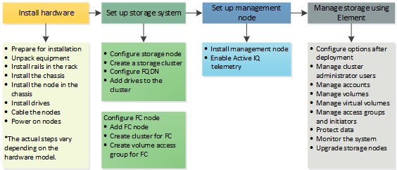

= Saiba mais sobre como configurar o armazenamento.
:allow-uri-read: 
:icons: font
:imagesdir: ../media/

[role="lead"]
Neste ponto, você deve ter instalado o hardware. O hardware também inclui o software Element.

Em seguida, você precisará configurar o sistema de storage para o seu ambiente. Você pode configurar um cluster com nós de storage ou nós Fibre Channel e gerenciá-lo usando o software Element depois de instalar e nós de cabo em uma unidade de rack e ligá-los.

.Passos para configurar o armazenamento
. Selecione uma das seguintes opções:
+
** link:../setup/concept_setup_configure_a_storage_node.html["Configurar cluster com nós de storage"]
+
Você pode configurar um cluster com nós de storage e gerenciá-lo usando o software Element após a instalação e os nós de cabo em uma unidade de rack e ligá-los. Em seguida, você pode instalar e configurar componentes adicionais em seu sistema de storage.

** link:../setup/concept_setup_fc_configure_a_fibre_channel_node.html["Configurar cluster com nós Fibre Channel"]
+
Você pode configurar um cluster com nós Fibre Channel e gerenciá-lo usando o software Element depois de instalar e conectar os nós em uma unidade de rack e ligá-los. Em seguida, você poderá instalar e configurar componentes adicionais em seu sistema de armazenamento.

. link:../setup/task_setup_determine_which_solidfire_components_to_install.html["Determine quais componentes do SolidFire instalar"]
. link:../setup/task_setup_gh_redirect_set_up_a_management_node.html["Configure um nó de gerenciamento e habilite a telemetria do Active IQ"]

[[find-more-information]]
== Encontre mais informações

* link:../setup/concept_setup_whats_next.html["Descubra os próximos passos para utilizar o armazenamento"]
* https://docs.netapp.com/us-en/element-software/index.html["Documentação do software SolidFire e Element"]

