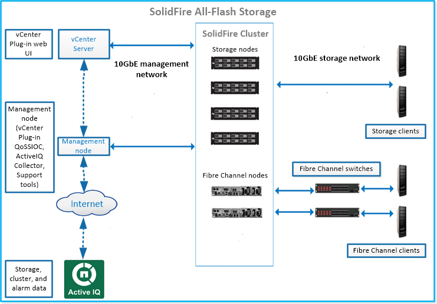

= Sistema de storage da SolidFire
:allow-uri-read: 
:icons: font
:imagesdir: ../media/

[role="lead"]
Um sistema de storage all-flash da SolidFire é composto por componentes de hardware distintos (unidades e nós) combinados em um único pool de recursos de storage por meio do software NetApp Element executado independentemente em cada nó. Esse cluster unificado se apresenta como um único sistema de storage para uso por clientes externos e é gerenciado como uma única entidade por meio da IU do software Element, da API e de outras ferramentas de gerenciamento.

Com a interface de usuário do software NetApp Element, você pode configurar e monitorar a capacidade e o desempenho do storage do cluster do SolidFire e gerenciar a atividade do storage em uma infraestrutura de alocação a vários clientes.

Um sistema de storage all-flash SolidFire inclui os seguintes componentes:

* Nós: Hardware físico que fornece os recursos de storage para um cluster. Existem dois tipos de nós:
+
** Nós de storage: Servidores que contêm uma coleção de unidades.
** Nós Fibre Channel (FC): Usado para conectar clientes FC por meio de um switch Fibre Channel.

* Cluster: O hub do sistema de storage SolidFire composto por pelo menos quatro nós.
* Nó de gerenciamento: Permite atualizar e fornecer serviços de sistema, incluindo monitoramento e telemetria, gerenciar ativos e configurações do cluster, executar testes e utilitários do sistema e fornecer acesso ao suporte NetApp para solução de problemas. O nó de gerenciamento (mNode) é uma máquina virtual que é executada em conjunto com um cluster de storage baseado em software Element.
* Active IQ: Uma ferramenta baseada na Web que fornece visualizações históricas continuamente atualizadas de dados em todo o cluster. Você pode configurar alertas para eventos, limites ou métricas específicos. Com o Active IQ, você monitora a performance e a capacidade do sistema, além de se manter informado sobre a integridade do cluster.
* As unidades são usadas em nós de storage e armazenam dados para o cluster. Um nó de armazenamento contém dois tipos de unidades:
+
** As unidades de metadados de volume armazenam informações que definem os volumes e outros objetos dentro de um cluster.
** Unidades de bloco armazenam blocos de dados para volumes de aplicações.

