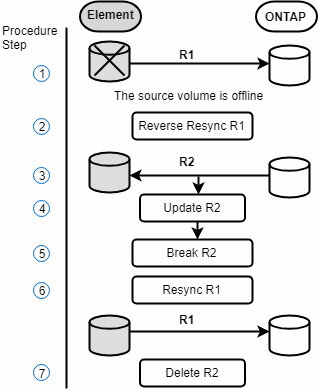

= Cenários de failback do SnapMirror
:allow-uri-read: 
:icons: font
:imagesdir: ../media/

[role="lead"]
A funcionalidade de recuperação de desastres do SnapMirror é ilustrada em dois cenários de failback. Estes assumem que o relacionamento original foi falhado sobre (quebrado).

Os passos dos procedimentos correspondentes são adicionados para referência.

NOTE: Nos exemplos aqui, R1 é a relação original em que o cluster que executa o software NetApp Element é o volume de origem original (elemento) e ONTAP é o volume de destino original (ONTAP). R2 e R3 representam as relações inversas criadas através da operação ressincronizada reversa.

A imagem a seguir mostra o cenário de failback quando o volume de origem ainda existe:

A imagem a seguir mostra o cenário de failback quando o volume de origem não existe mais:

image::../media/snapmirror_element_failback2.png[elemento SnapMirror failback2]

== Encontre mais informações

* xref:task_snapmirror_perform_failback_when_source_volume_exists.adoc[Execute um failback quando o volume de origem ainda existir]
* xref:task_snapmirror_performing_failback_when_source_volume_no_longer_exists.adoc[Execute um failback quando o volume de origem não existir mais]

