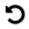

= Ícones na interface do elemento
:allow-uri-read: 
:icons: font
:imagesdir: ../media/

[role="lead"]
A interface do software NetApp Element exibe ícones para representar as ações que você pode executar nos recursos do sistema.

A tabela a seguir fornece uma referência rápida:

|===

| Ícone | Descrição 

 a| 
image:../media/element_icon_action.gif["Ícone ações na IU da Web do Element OS"]
 a| 
Ações

 a| 
image:../media/element_icon_backupto.gif["Ícone de Backupto na IU da Web do Element OS"]
 a| 
Backup para

 a| 
image:../media/element_icon_clone.gif["Clone o ícone na IU da Web do Element OS"]
 a| 
Clone ou cópia

 a| 
image:../media/element_icon_delete.gif["Excluir ícone na IU da Web do Element OS"]
 a| 
Eliminar ou purgar

 a| 
image:../media/element_icon_edit.gif["Editar ícone na IU da Web do Element OS"]
 a| 
Editar

 a| 
image:../media/element_icon_filter.gif["Ícone de filtro na IU da Web do Element OS"]
 a| 
Filtro

 a| 
image:../media/element_icon_pair.gif["Ícone de emparelhamento na IU da Web do Element OS"]
 a| 
Emparelhar

 a| 
image:../media/element_icon_refresh.gif["Atualizar ícone na IU da Web do Element OS"]
 a| 
Atualizar

 a| 

 a| 
Restaurar

 a| 
image:../media/element_icon_restorefrom.gif["Restaurar a partir do ícone na IU da Web do Element OS"]
 a| 
Restaurar de

 a| 
image:../media/element_icon_rollback.gif["Ícone de reversão na IU da Web do Element OS"]
 a| 
Reverter

 a| 
image:../media/element_icon_snapshot.gif["Ícone de snapshot na IU da Web do Element OS"]
 a| 
Snapshot

|===